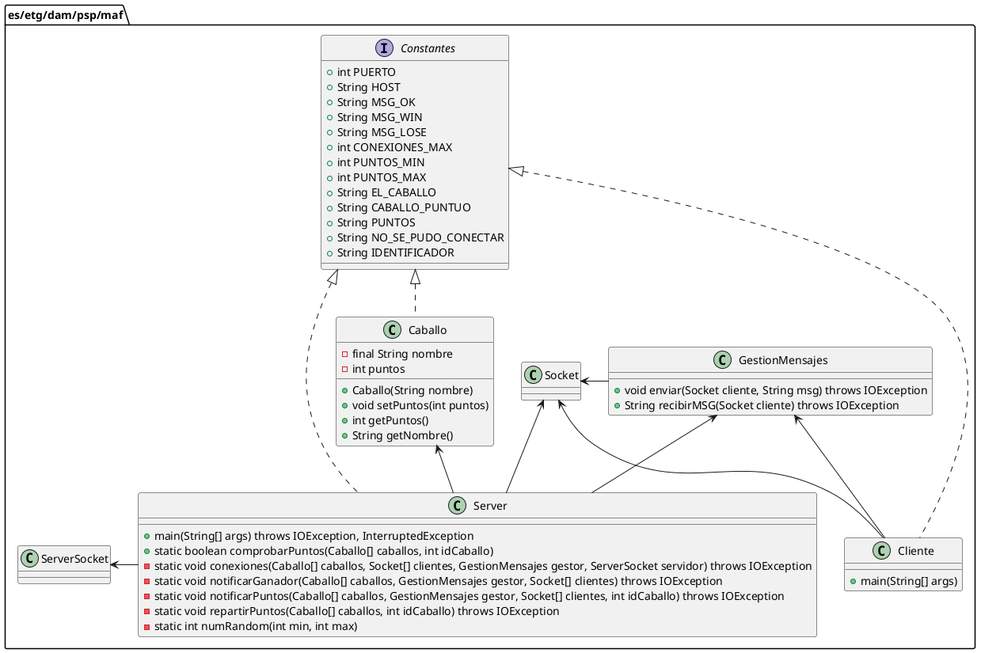

# Arquitectura del problema
La Arquitectura con la que se realizo este proyecto, es la arquitectura "cliente-servidor"
# Diseño del protocolo y de la solucion
## Diseño del protocolo
```plantuml
Servidor <- Cliente: Nombre caballo
Cliente <--- Servidor: "OK"
Servidor ---> Cliente: Puntos
Servidor <--- Cliente: Ganaste/Perdiste
```
## Diseño de la solucion

